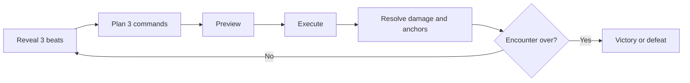
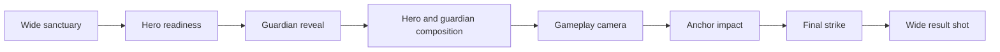

# The Last Sequence

Gameplay specification for the Command Pattern vertical slice.

The player reads a guardian's three-beat attack pattern, queues three commands, and turns those attacks against three corrupted anchors. Destroying every anchor exposes the guardian for one decisive final strike.

## Contents

- [Experience](#experience)
- [Core loop](#core-loop)
- [Rules](#rules)
- [Examples](#examples)
- [Acceptance criteria](#acceptance-criteria)
- [Presentation](#presentation)
- [UI](#ui)
- [Visual direction](#visual-direction)
- [Replay and technical boundaries](#replay-and-technical-boundaries)

## Experience

| Target | Definition |
| --- | --- |
| Run length | 5–8 minutes |
| Arena | 7×7 forest sanctuary |
| Player | Sword-and-shield hero, three hearts |
| Objective | Destroy three anchors, then perform `FinalStrike` |
| Defeat | Zero hearts or turn 8 |
| Platform | Desktop keyboard first |

The intended feeling is: read the threat, take a calculated risk, turn the guardian's strength against it, and finish with impact.

## Core loop



Each beat resolves in this order: player movement, guardian anticipation, movement completion, attack, damage/anchor result.

## Rules

### Board and planning

- Use three anchors and up to four blocked cells.
- The player starts at `(4,1)`; `(1,1)` is the lower-left cell.
- The guardian reveals a fixed three-beat pattern before planning.
- Queue exactly three commands. Empty slots become `Wait`.
- Preview and execution must use the same simulation rules.

### Commands

| Command | Rule |
| --- | --- |
| `Step` | Move one cardinal cell. |
| `Dash` | Move up to two cardinal cells; cannot cross blockers. |
| `Guard` | Stay in place and block one hit on that beat. |
| `Wait` | Stay exposed in place. |
| `FinalStrike` | Available only after all anchors are destroyed. |

### Anchors

An anchor awakens when the player ends a beat adjacent to it. A guardian attack destroys it when its area overlaps the awakened anchor. Destroyed anchors become blocked and increase difficulty.

### Guardian attacks

| Attack | Area | Player lesson |
| --- | --- | --- |
| `Line Blast` | Full row or column | Leave an anchor in the line while escaping. |
| `Arc Sweep` | Three-cell arc | Cross or avoid a broad danger zone. |
| `Rupture` | Target plus four neighbors | Choose escape, Guard, or controlled risk. |

## Examples

### Successful anchor setup

The player ends adjacent to an anchor, escapes on the next command, and the revealed attack overlaps the awakened anchor. The anchor breaks and becomes a permanent blocker.

### Successful plan

Guardian: `Line Blast` on row 3. Player: `Step Up`, `Step Right`, `Step Down`.

The preview shows the hero entering the setup position, leaving the line, and ending safely while the attack still crosses the anchor.

### Failed plan

Guardian: `Rupture` centered on the player's reveal-time cell. Player: three `Wait` commands.

The player takes one hit unless the first command is `Guard`. The result identifies the beat that caused the damage.

## Acceptance criteria

- **Reveal:** after the intro, three beats and their danger cells are visible.
- **Planning:** the player can add, remove, replace, and confirm up to three commands.
- **Consistency:** previewed positions, hits, and anchor results match execution.
- **Guard:** a Guard blocks one hit and is consumed.
- **Victory:** three destroyed anchors unlock `FinalStrike`, defeat the guardian, and show score and seed.
- **Defeat:** zero hearts or turn 8 stops planning and shows the reason.
- **Replay:** retrying a displayed seed reproduces its authored layout and pattern selection.

## Presentation

### Camera rules

- Gameplay uses one locked elevated three-quarter camera.
- Normal movement never moves the gameplay camera.
- Intro and finale use separate Cinemachine cameras and directors.
- Every shot must establish, reveal, emphasize, impact, or resolve something.
- Preserve the hero/guardian screen axis between shots.
- Hold each subject long enough to read its silhouette and animation.
- Explicitly return to the gameplay camera after every cinematic.

### Storyboard



The intro should orient before it impresses. The finale should expose the guardian, hold its vulnerability, show the hero's anticipation, deliver the strike, show the reaction, and end on a wide sanctuary shot.

## UI

```text
┌──────────────────────────────────────────────┐
│ Guardian: [1 Intent] [2 Intent] [3 Intent]   │
│                                              │
│                 7 × 7 ARENA                  │
│                                              │
│ Hearts ♥♥♥   Anchors 0/3   Turn 1/8          │
│ [1 Step] [2 Dash] [3 Guard] [4 Wait]         │
│ Queue: [ command ] [ command ] [ command ]   │
│ Enter Confirm   Backspace Undo   Delete Clear│
└──────────────────────────────────────────────┘
```

Planning shows intents, danger beats, queue, hints, hearts, anchors, and turn. Execution shows only the active beat and result. Results show outcome, score, seed, retry, and new run. Never rely on color alone; combine color with position, shape, or motion.

## Visual direction

An inviting fantasy sanctuary becomes dangerous at its center: stylized forest forms, readable silhouettes, controlled contrast, and theatrical magical attacks.

- Environment: `RPG Tiny Fantasy Forest PBR`.
- Hero: `RPG Tiny Hero Duo` sword-and-shield variant.
- Guardian: `RPG Monster Partners` Beholder variant.
- Environment palette: deep blue-green and desaturated forest green.
- Safe information: warm gold or cyan.
- Corruption: magenta-violet.
- Immediate danger: red-orange.
- The environment frames the board and never obscures cells or actors.
- Anchor destruction and the final strike are the strongest visual rewards.

## Replay and technical boundaries

The seed selects authored anchor sockets, blocker sockets, patterns, and cosmetic accents. Never repeat the same complete pattern twice in a row. Always preserve a valid route and reachable anchor.

Gameplay code owns state, simulation, commands, outcomes, and cinematic transitions. Cinemachine/Timeline own shot sequencing, blends, and authored presentation. Project-owned material or prefab adaptations belong in `Assets/Shared`; vendor source remains under `Assets/ThirdParty`.
