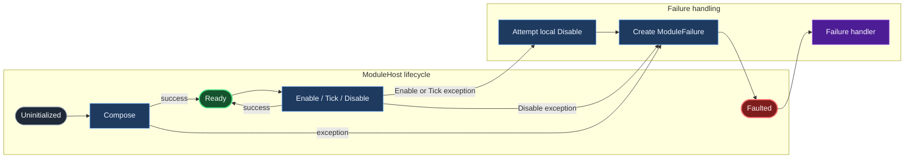

# Module Hosting

Shared infrastructure for hosting Unity gameplay modules behind a small,
fault-contained lifecycle boundary.

## Lifecycle

Create the host with a module factory and failure handler, then compose it once:

```csharp
var host = new ModuleHost<MyModule>(CreateModule, HandleFailure);
host.Compose();
```

When composition succeeds, the host forwards `Enable`, `Disable`, and `Tick`
to the module. A failure during composition or lifecycle execution moves the
host to `Faulted` and reports a `ModuleFailure` through the configured handler.

Failed lifecycle operations are isolated from the caller where possible. The
host also attempts to disable a module after an `Enable` or `Tick` failure.

`Compose` is intended to be called once. Calls made after the host leaves the
`Uninitialized` state are ignored.

## Flow


