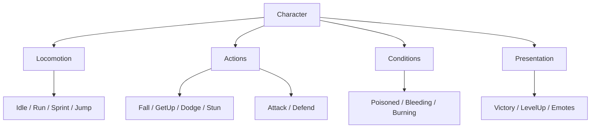
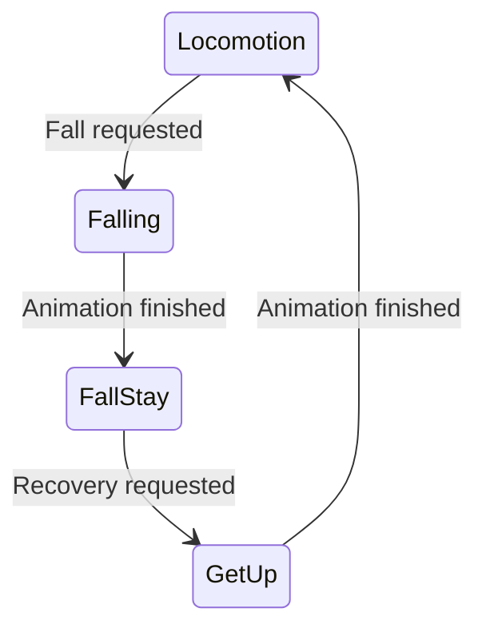
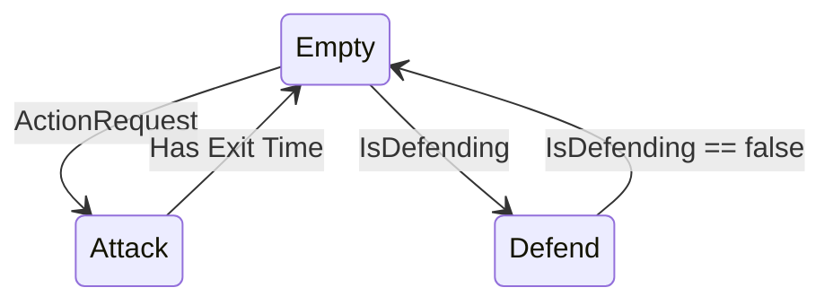

# Animator Architecture

This Animator separates character movement, actions, persistent conditions and
presentation feedback into dedicated responsibilities. Each responsibility has
its own layer and animation contract.



## Animator layers

| Layer | Responsibility | Blend | Mask |
| --- | --- | --- | --- |
| `Locomotion` | Idle, run, sprint, jump and air movement | Base | Full body |
| `Full Body Actions` | Fall, FallStay, GetUp, dodge, stun, hit reaction and death | Override | Full body |
| `Upper Body Actions` | Attack, defend, cast and interact | Override | Torso, arms and head |
| `Conditions` | Dizzy, poisoned, bleeding, burning and other persistent effects | Override or additive | Effect-specific |
| `Presentation` | Victory, level up and emotes | Override | Full body or upper body |

The base locomotion layer normally stays at weight `1.0`. Action, condition and
presentation layers are enabled only while they have an active animation.

## Locomotion

Movement belongs to the locomotion layer. Gameplay code calculates the actual
position and direction; the Animator only represents that result visually.

The locomotion states are:

```text
Idle
Run
Sprint
Jump Start
In Air
Jump Land
Air Jump Start
In Air Spin
```

Recommended parameters:

```text
MoveX      : Float
MoveY      : Float
IsGrounded : Bool
JumpRequest: Trigger
```

## Full body actions

Full body actions temporarily replace locomotion because they use the complete
character rig.



`Fall`, `FallStay` and `GetUp` are phases of one fall action, not three
independent actions competing for control of the character.

Typical control rules while falling:

```text
CanMove   = false
CanAttack = false
CanDefend = false
```

The same category can contain dodge, roll, stun, hit reaction and death. Each
action should have a clear animation contract and a corresponding gameplay rule
that decides which actions are currently allowed.

`Stun` belongs here when it means the character is incapacitated. It uses the
full body and prevents locomotion and other actions for its duration. `Dizzy`
is reserved for the persistent condition; a visual representation can use the
name `DizzyFeedback`.

## Upper body actions

Upper body actions allow the locomotion layer to continue animating the legs.

```text
UpperBodyActionIndex   : Int
UpperBodyActionRequest : Trigger
IsDefending            : Bool
```

`Attack` is usually a one-shot state. `Defend` is usually a loop controlled by
`IsDefending`.



An attack may allow reduced movement, while defending may reduce movement speed
and disable attacks. Those decisions belong to gameplay control rules, not to
the animation layer itself.

## Conditions

Conditions are persistent effects and have their own animation contract. They
may influence gameplay values, but they do not replace locomotion or action
states.

Examples:

```text
Poisoned
Bleeding
Burning
Frozen
Slowed
Dizzy
```

Condition parameters can be independent booleans:

```text
IsPoisoned : Bool
IsBleeding : Bool
IsBurning  : Bool
IsFrozen   : Bool
IsDizzy    : Bool
```

For example, `Poisoned` can show a green visual effect and apply periodic damage
while the character continues to move and attack. `Dizzy` can affect accuracy or
movement responsiveness without becoming the full-body `Stun` action.

```text
Poisoned != CannotMove
```

## Presentation

Presentation animations communicate feedback and are not automatically gameplay
conditions.

| Animation | Typical layer | Typical control impact |
| --- | --- | --- |
| `Victory` | Full body | Blocks gameplay |
| `LevelUp` | Full body or upper body | Usually blocks gameplay briefly |
| `Taunt` | Upper body | Usually allows movement |
| `Emote` | Upper body or full body | Feature-dependent |

If a future visual effect represents dizziness without incapacitating the
character, it can be added to `Presentation` with a more specific name such as
`DizzyFeedback`. The incapacitating action remains `Stun` in `Full Body Actions`.

## Responsibility map

```text
Locomotion
    Represents movement and physical navigation.

Actions
    Represents deliberate actions performed by the character.

Conditions
    Represents persistent effects applied to the character, such as Poisoned,
    Bleeding or Burning.

Presentation
    Represents feedback, celebration and communication.

Gameplay rules
    Decide whether movement, attack, dodge or defense are currently allowed;
    Animator layers only represent the resulting behavior.
```

Use this decision rule when adding a new animation:

```text
Persistent effect?                 -> Condition
Action performed by the character? -> Action
Movement or physical navigation?   -> Locomotion
Feedback or communication?         -> Presentation
Blocks gameplay actions?            -> Full Body Action
```

Each layer owns a separate animation contract. Locomotion parameters describe
movement, action parameters request actions, condition parameters represent
persistent effects, and presentation parameters request feedback. This keeps
poison, attack, victory and falling independent while allowing them to coexist
when their masks and gameplay rules permit it.
